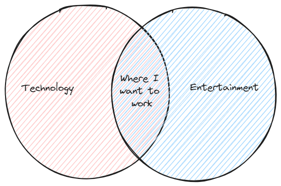

<h4 align="center">Hello, and welcome to my Github!</h4>

    

I'm a seasoned Software Engineer and an avid creator in the Entertainment Production realm, where I fuse my technical prowess with my passion for film and music projects. As I navigate the exciting landscape of Entertainment Technology, I am eager to explore opportunities that leverage my extensive background and forward-thinking innovations, particularly those involving AI art tools and AR/VR, to redefine the industry's future.

In my journey through the software engineering landscape, I've honed my craft with four diverse companies in the healthcare sector, engaging in the full spectrum of the Software Development Life Cycle (SDLC)—from initial concept to deployment and ongoing maintenance. My technological fluency spans the entire development stack; I am adept in backend technologies like C# and Node.js, proficient with databases such as SQL Server and MongoDB, skilled in front-end frameworks including React and Vue, and comfortable with Python and Bash scripting. My infrastructure management capabilities encompass Terraform and robust CI/CD pipelines with tools like CircleCI, CodeBuild, and CodePipeline, all within the expansive ecosystem of AWS cloud solutions.

## [You can view my reusme here!](https://github.com/CryptoChrisJames/CSResume)

Parallel to my tech career, my passion for music production and audio engineering paved the way towards an adventurous foray into film production. Starting with guitar riffs and evolving to write and produce across an eclectic mix from hip-hop to heavy metal, I've crafted over a hundred tracks, including several mixtapes, honing my skills in recording, mixing, and mastering. My technical expertise segued into a role as a Digital Imaging Technician (DIT) on a short film, igniting a fervent interest in film production that led to producing four shorts and currently my debut feature film. In the world of film, I've worn many hats: from producer to DIT, from cinematographer to audio engineer, and I've even stepped in front of the camera as an actor.

## [You can see some of my entertainment work here!](https://www.cryptochrisjames.com/ent)

As you can see, my skillset is both broad and robust. However, I've recently become more passionate about finding some area where these two feilds overlap:

    

